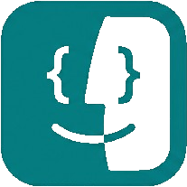

<p align="center">
  
</p>

# macOS Dev Setup

Welcome to your ultimate macOS developer setup! This tool is designed to bootstrap a fresh machine with elegance, speed, and zero friction. Whether you're a terminal purist or an IDE power user, this script simplifies your onboarding experience.

## Interactive Setup

The primary way to set up your machine is via the interactive wizard. It walks you through different categories of software (Terminals, IDEs, Browsers, Utilities, etc.) and lets you pick exactly what you need.

### Quick Start

1. Clone the repository:
   ```bash
   git clone https://github.com/6ameDev/dev-setup.git
   ```

2. Navigate into the directory:
   ```bash
   cd dev-setup
   ```

3. Run the setup script:
   ```bash
   ./setup.sh
   ```

**Features:**
- **Interactive Selection**: Uses `gum` for a sleek, terminal-based selection UI.
- **Smart Bootstrapping**: Automatically installs Homebrew and `gum` if they are missing.
- **Extensible**: Software lists are managed in a separate [apps.conf](apps.conf) file. Add new groups or programs with zero changes to the script logic.

---

## Roadmap & Future Updates

- [ ] **Automatic Configuration Application**: If a selected software (cask or formula) has a recommended configuration file stored in this repository (e.g., in the `terminals/` directory), it will be applied automatically during the installation process.
